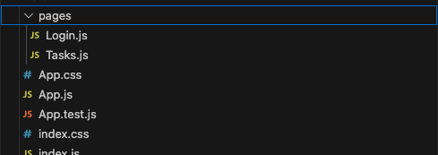

# **Angular for React Developers Part One: Routing**

In a web application, routing refers to how a user navigates from point A to point B. In most cases, the user lands on the home page and clicks on a link to the page they are interested in. Once the target page is displayed, they can return to the home via the browser’s back button or explore links to other pages displayed on any page or through navigation elements, such as a top bar or side menu.

## **Objectives**

In this article, we will build the foundations of our task management application. We will create two pages. The first is a placeholder Login page with a title and link to the application’s Tasks page.


We will also create a placeholder Home page with a link to the Login page.


The code for this app is available on GitHub at [ng-task-tutorial-01](https://github.com/trider/ng-task-tutorial/tree/main/ng-task-tutorial-01). The samples in this tutorial were written in Angular 18\.

The React sample code is available from [react-task-tutorial](https://github.com/trider/react-task-tutorial/tree/main).

## **React Routing**

Let’s start by creating a new task management web application.

```bash
npx create-react-app react-task-app
```

After removing the boilerplate code from App.js, we create our Login and Tasks page components.



Since React has no built-in routing component, we install [React Router](https://reactrouter.com/).

```bash
npm install react-router-dom
```

React Router includes several different Routers, so for the sake of simplicity, we will use the [BrowserRouter](https://reactrouter.com/en/main/router-components/browser-router). This stores a link’s URL in the browser’s address bar and lets you navigate forward and backward to and from the page. In our App.js file, let’s add a reference to BrowserRouter. In our App.js file, we add a reference to BrowserRouter.

```javascript
import { BrowserRouter } from "react-router-dom";
```

To use the BrowserRouter, we must also define Routes and Route elements, so we reference these elements.

```javascript
import { BrowserRouter, Routes, Route } from "react-router-dom";
```

Now we add the Browser router to the App function with a child Routes object. We will define the Routes for each page.

```javascript
function App() {
 return (
   <div className="App">
     <BrowserRouter>
       <Routes>
         <Route path="/" element={<Login />} />
         <Route path="/tasks" element={<Tasks />} />
       </Routes>
     </BrowserRouter>


   </div>
 );
}
```

To navigate between pages, we add a link object to each page. First, let’s update Login.js

```javascript
import {  Link } from "react-router-dom";
const Login = () => {
 return (
   <div>
     <h1>Login</h1>
     <p>Part 1: The Basics</p>
     <Link to="/tasks">Go to tasks</Link>
   </div>
 );
}
export default Login;
```

Next, we update Tasks.js and we’re done.

```javascript
import {  Link } from "react-router-dom";

const Tasks = () => {
 return (
   <div>
     <h1>Tasks</h1>
     <p>TBD</p>
     <Link to="/">Go to login</Link>
   </div>
 );
}
```

## **Routing in Angular**

Since the release of Angular 2.0, routing in Angular is handled by a built-in routing component. Once you achieve a basic understanding of Angular routing, you realize that routing is more than a navigation mechanism, it defines the structure of your application and provides a hierarchical map of how each part links together. In addition to letting you navigate from one page to another, Angular’s router has many powerful and useful features. These features include a mechanism that ensures only authorized users can access specific pages (AuthGuard), creating parameterized URLs, and managing page metadata.

### **Getting Started**

In contrast to React’s bear-bones approach to building web apps, Angular’s highly structured approach can seem overwhelming. Before you can write any Angular code, you must first install Angular’s command line interface.

```bash
npm install \-g @angular/cli
```

Next, we run ng new to create a new project and accept the default options. Note that when asked for a template format, choose SCSS.

```bash
ng new ng-task-demo-app
```

Now, let's open src/app/app.component.html, apart from the router-outlet tag, and remove all the boilerplate code from this file.

```html
<router-outlet />
```

To ensure consistent presentation across application components we will update src/styles.scss. Open the file and add the following.

```css
body { text-align: center;}
```

### **Creating Components**

Our task application will have two components. The first is a Login page and the second is the Tasks page. We create components with the following command.

ng generate component login

The command generates the following components.

![][image4]

An Angular component is a TypeScript file that includes three things. The first of these is a set of references to framework modules and other application resources.

`import { Component } from '@angular/core';`  
Following the references is an @Component directive. Angular directives come in many forms and they provide different types of functionality. The @Component directive defines component-specific metadata, such as the component’s selector (name) and the component modules it imports. It also includes references to the component template and template-specific styling. The component template can be the component's HTML code and Angular directive, or it can be a link to a file. Likewise, component styling can be either style-sheet code or a link to a component stylesheet.

`@Component({`  
 `selector: 'app-login',`  
 `standalone: true,`  
 `imports: [],`  
 `templateUrl: './login.component.html',`  
 `styleUrl: './login.component.scss'`  
`})`  
The final and largest part of the component is the component class. The class contains component variables and logic

`export class LoginComponent {}`  
Run the command again to create the Tasks component.

ng generate component tasks

### **Adding Routes**

Now we have created our components, we need to provide a way to find them and navigate between them. Angular’s navigation mechanism is called routing, and each route is a relative path (URL) within the application. We define each route in the app.routes.ts file. Open the file, and add references to the Login and Tasks components.

`import { Routes } from '@angular/router';`  
`import { LoginComponent } from './login/login.component';`  
`import { TasksComponent } from './tasks/tasks.component';`

In the Routes object, we will add a route for each component. Each path has two elements: path and component.

* Path: indicates the relative path of the component within the application.
* Component: indicates the component associated with the path.

`export const routes: Routes = [`  
 `{ path: 'login', component: LoginComponent },`  
 `{ path: 'tasks', component: TasksComponent },`  
`];`

Let’s launch the app and see what happens. At the command line, type

Ng serve

![][image5]

Click the local to open the app in a browser. The browser displays a blank page. In the browser’s address bar, type /login. You should see the following.

Refresh your browser, and you should be able to navigate from the Login page to the Tasks page and back.

![][image6]

To ensure that this page opens when we launch the app, we will add a default path.

`export const routes: Routes = [`  
 `{ path: '', redirectTo: '/login', pathMatch: 'full' },`  
 `{ path: 'login', component: LoginComponent },`  
 `{ path: 'tasks', component: TasksComponent },`  
`];`  
Now, when the application is launched, the Login page opens.

### **Navigating Between Pages**

With our Login and Tasks pages in place, we add links to navigate from one page to another. Angular lets you navigate between components with the RouterLink directive.

FIrst, open login.component.ts and add the following reference.

`import { RouterLink } from '@angular/router';`

In @Component, add RouterLink to the imports array.

 `imports: [RouterLink],`

Now open login.component.html and add the following.

`<h1>Login</h1>`  
`<p>Part 1: The Basics</p>`  
`<p><a routerLink="/tasks">Tasks</a></p>`

Do the same for the Tasks page.
