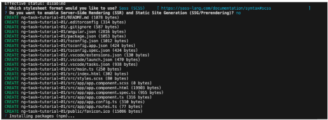

# **Accelerated Angular Part 1: Getting Started**

As I explain in my series [Rapid React](https://www.linkedin.com/pulse/rapid-react-key-concepts-jonathan-gold-fx3uf/?trackingId=q8ZSMYAmTve4djU9SC%2F53w%3D%3D), [React](https://react.dev/) was designed to be a fast and responsive web application development platform. To this end, It is delivered as a compact library that gives you the features you need most and then gets out of your way. Despite its overwhelming popularity, sometimes you need an alternative approach, such as Angular. One of Angular’s greatest strengths is it is a comprehensive solution with a wide range of tools for building web applications. One of Angular’s great strengths is that it provides a structure and a philosophy for how to build apps. 

This series is aimed to get you up and running, building your Angular-based web apps as rapidly as possible with a series of short and focused articles. In this installment, I will give you a brief introduction to Angular and how to create your first Angular project. The sample code for this installment is available on [Github](https://github.com/trider/accelerated-angular-tutorial/tree/0efe3324575f249d69272ad6becfbc656bf84994/ng-task-tutorial-01)

## **Key Concepts**

Each article in this series will start with a section that introduces key concepts. Since Angular is designed to build single-page applications, this section describes the concept and then gives you a brief introduction to Angular.

### **Single Page Applications**

[Angular](https://angular.dev/overview) lets you build [single-page web applications](https://www.bloomreach.com/en/blog/what-is-a-single-page-application#:~:text=A%20single%20page%20application%20is,browser%20loading%20entire%20new%20pages.) (SPA). These dynamically load content and display it using a single HTML page. This page acts as a container or master page that presents the individual pages of your web app and lets you navigate between them. The SPA fetches data from the server and interacts with users locally within the browser, thus providing a faster and more responsive user experience than equivalent server-side apps. 

### **What is Angular**

Angular is more than just a framework. It is a platform for building browser-based, single-page applications. In fact, in its original version, Angular 1x, Angular was one of the first modern frontend frameworks. Without going into detail, Angular’s creators at Google decided that the framework had become too large and complicated. So, in 2016, they released a revised version, Angular 2x on which all subsequent versions of Angular are based. The foundation of Angular is its command line interface (CLI). The CLI provides tools for generating, building, running, and deploying Angular projects. Angular projects are built on components and services. Components are a fundamental building block within a project. Each component contains two elements: presentation and logic. Services are a way of sharing functionality and data between components. We will explore both components, services, and other key concepts in subsequent installments.

## **Installing the Angular CLI**

As mentioned previously, the Angular CLI provides a wide range of tools for building Angular apps. Before you can install the Angular, check you have [NodeJS](https://nodejs.org/en) and the [Node Package Manager (NPM)](https://www.npmjs.com/) installed on your PC. In a terminal window or an IDE’s integrated terminal, type the following:

`npm install -g @angular/cli`

## **Create a Project**

In a terminal window or an IDE’s integrated terminal, find a suitable location on your PC’s file system. Then, use the CLI’s ng new command to create a new Angular project, for example.

`ng new ng-task-tutorial`

The installation process will ask you if you want to send analytic data back to Google. You can respond yes (Y) or no (N).

Next, it asks you what stylesheet format you prefer. The sample code in this project uses SCSS.

Next, the CLI asks if you want to enable Server Side Rendering. Since we will not be covering this topic, respond No. The project is generated, and the required NPM packages are installed.

## **Running the Project**

Once the project is created, you can run it. In a terminal window or an IDE’s integrated terminal, open the project folder.

`cd ng-task-tutorial-01`

In the project folder, launch the project by typing:

`ng serve`

The project code is compiled.

When the process is completed, and the site is running ,click:

 ➜  Local:   [http://localhost:4200/](http://localhost:4200/)

The following is displayed in the browser.

## **Conclusion and What’s Next**

Since this series is called Accelerated Angular, this installment kicked things off as fast as possible. After a brief introduction to Angular, we installed the CLI created and ran a boilerplate project. In the Next installment, we will start building out a Task Management web app. See you then.
