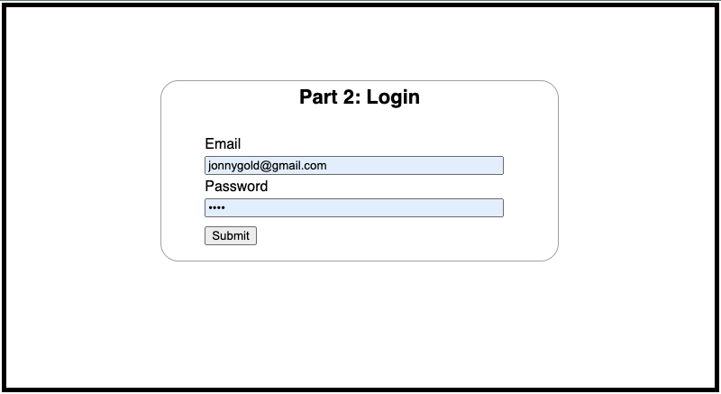

# **Angular for React Developers Part 2: User Interaction and Forms**

In the first part of this series, we discussed navigation and routing and examined the different approaches of React and React. Angular, we created placeholder pages for a task management web app. The app had two pages Login and Tasks. Now, we have a foundation in place, we can build on it and add some basic functionality. In this article, we will add a form to the Login page.



The form enables a user to type an email and password. When the user presses the Submit button, the app checks the submitted credentials and authenticates the user. If the user’s credentials are valid, the application displays a message and navigates to the task page.

For the sake of simplicity, user credentials are stored in plain text in a Javascript file. In addition, some styles from a CSS template have been applied to the Login and Tasks files. All the files referenced in this article, and the sample [Angular](https://github.com/trider/ng-task-tutorial/tree/main/ng-task-tutorial-02) and [React](https://github.com/trider/react-task-tutorial/tree/main/react-task-tutorial-02) code are available from GitHub.

## **Building React Forms**

Let’s build a React equivalent of our Angular app’s Login page. First, we would create a file called Login.js. At the top of the file, we reference React’s useState hook to manage the Login form’s local state variables; such as email, password, and user (profile). Next, we add a reference to the React Routers, Navigate hook. The final reference is to the Users data file that stores the application’s user profile data.

```javascript
import { useState } from 'react';
import { Navigate } from "react-router-dom";
import Users from '../data/users';
```

Now, we add the component’s main (Login) function.

```javascript
const Login = () => {
 return (<div className="card"></div>);
}
export default Login;
```

In the Login() function, we declare variables to store the local state of the user’s credentials (email, password) and authenticated user profile. In the Login() function, we declare variables to store the local state of the user’s credentials (email, password) and authenticated user profile. Each state variable is an array with two elements. The first element is the variable name that stores a local state value, such as email. The second is a reference to a function that updates the state using useState, such as setEmail.

```javascript
const Login = () => {
 const [email, setEmail] = useState("");
 const [password, setPassword] = useState("");
 const [user, setUser] = useState();
}
```

After we have declared our state variables, we can use them to collect and display form data. When the user types a value in the form’s Email or Password fields an onChange(e) event is triggered. This updates the local state of the relevant variable.

```javascript
const Login = () => {
  return (
   <div className="card">
    <form>
     <label>Email</label>
     <input
      type="email"
      name="username"
      placeholder="Enter email"
      value={email}
      onChange={(e) => setEmail(e.target.value)} />
     <br/>
     <label>Password</label>
     <input
      type="password"
      name="password"
      placeholder="Password"
      value={password}
      onChange={(e) => setPassword(e.target.value)}/>
     <br/>
     <button type="submit">Login</button>
    </form>
   </div>
 );
}
```

When the user submits their credentials, the function declares a value called currentUser. currentUser queries the list of users and matches the supplied credentials. If the query matches a single user, a message is displayed. Then, setUser is called to add the profile to the component’s local state. Since the default value of the local state’s user object is Null, once it is updated with valid data, the function can display the Tasks page.

```javascript
const Login = () => {
  return (
   <div className="card">
   <h1>Part 2:Login</h1>
    {user && (<Navigate to="/tasks" replace={true} />)}
    <form onSubmit={(e) => {
      e.preventDefault();
      const currUser = Users.filter((user) => user.email === email &&
      user.password === password)[0];
      if(currUser){
      alert(`Email: ${email}\nPassword: ${password}`);
      setUser(currUser);
      }
      else{ alert("Invalid email or password");}
      }} >
      ...
    </form>
   </div>
 );
}
```

## **User Interaction with Angular**

Like Routing, Angular supports user interaction with forms as part of its comprehensive approach to web application development. To complicate matters [Angular](https://angular.dev/guide/forms) has two different models for implementing forms: [Template-driven](https://angular.dev/guide/forms/template-driven-forms) and [Reactive](https://angular.dev/guide/forms/reactive-forms).

As the name suggests, template-driven forms let you create forms using templates that resemble generic HTML forms. Reactive Forms takes a completely different, Angular-centric approach to forms management. This approach uses a combination of Typescript code and Angular Directives to build a form. Without going into details regarding the relative merits of each approach, Template-driven forms are regarded as simpler, and Reactive forms are considered the more complex option.

Despite their added complexity and steeper learning curve, Reactive forms offer a range of powerful and flexible features. This is why Reactive forms are the preferred option for Angular development. For this reason, we will use them to illustrate Angular form management.

Note that the template and styles for this project are listed in app/styles.scss. User profiles are stored in app/data/users.ts. Both these files can be downloaded from  [GitHub](https://github.com/trider/ng-task-tutorial/tree/main/ng-task-tutorial-02).

### **Component Setup**

Before adding a form to our Login component, we must reference Angular’s ReactiveFormsModule. Open src/app/login.component.ts and add the following.

```javascript
import { ReactiveFormsModule} from "@angular/forms";
```

Next in @Component, update imports.

```javascript
@Component({
 selector: 'app-login',
 standalone: true,
 imports: [ ReactiveFormsModule],
 templateUrl: './login.component.html',
 styleUrl: './login.component.scss'
})
```

### **Declaring and Initizialing the Form**

In the Login Component class, add a FormGroup called loginForm. A FormGroup contains a group of FormControls and manages form data (state) and related events.

```javascript
export class LoginComponent{
 loginForm = new FormGroup({});
}
```

In loginForm, add two FormControls called email and password. These controls will collect and manage the data the user types into form fields. In our scenario, the FormControls perform a similar role to the useState hook. By default, the controls are empty but can be pre-populated with data.

```javascript
loginForm = new FormGroup({
 email: new FormControl(''),
 password: new FormControl(''),
});
```

Before we update the component template, let's add an empty onSubmit method. This prevents the Angular compiler from throwing an exception when the method is referenced from our form.

```javascript
loginForm = new FormGroup({
 email: new FormControl(''),
 password: new FormControl(''),
});
onSubmit(){}
```

### **Add the Form Template**

Open login.component.ts, delete the current content of the file and add the following. This div will contain the Login form.

```javascript
<div class="card">
 <h1>Part 2: Login</h1>
</div>
```

After the header, add an HTML form.

```html
<form></form>
```

To connect the form to the FormGroup, add a reference to loginForm.

```html
<form [formGroup]="loginForm"></form>

```

Now, we add the controls to the form. For each control, we add a formControlName to reference each control’s respective FormControl in the FormGroup.

```html
<form [formGroup]="loginForm">
 <label for="email" >Email</label><br/>
 <input formControlName="email" id="email" required /><br/>
 <label for="password" >Password</label><br/>
 <input formControlName="password" type="password" /><br/>
</form>
```

The form should look like this:


Once the controls are in place, we need to add a button. This lets the user submit their credentials for authentication.

```html
<form [formGroup]="loginForm">
 ...
 <button type="submit">Submit</button>
</form>
```

The final step is to ensure that when the user clicks the button, something happens. We do this by adding an ngSubmit directive that calls the LoginComponent’s onSubmit() method.

```html
<form [formGroup]="loginForm" (ngSubmit)="onSubmit()"></form>
```

### **Authenticating the User**

At this point, when the user presses Submit, nothing happens. Now we will add the required functionality to process the user’s credentials. Although we added a reference to User.ts, LoginComponent is unable to read it. This requires declaring a variable and assigning it the contents of the file.

```javascript
export class LoginComponent{
 users:any = Users;
}
```

Once we have authenticated the user, we want to be able to persist and reference their profile information. For this purpose, we declare a user variable.

```javascript
users:any = Users;
user:any = null;
```

To authenticate the user, and persist their profile we filter the list of Users using the supplied credentials. We match the relevant values in the profile against the value held by the form control. For example, we can extract the submitted email address with this.loginForm.value.email.

```javascript
onSubmit(){
 this.user = this.users.filter((user:any) =>
  user.email === this.loginForm.value.email &&
  user.password === this.loginForm.value.password)[0];
 }
}
```

The results of the filter are assigned to this.user, by default this.user is null.

```javascript
if(this.user !== null ){
 alert(`Email: ${this.user.email}\nPassword: ${this.user.password}`);
 sessionStorage.setItem('user', JSON.stringify(this.user));
}
```

If a valid user profile is assigned to this.user, a message is displayed and the user’s profile data is persisted to the browser’s session storage.


### **Displaying Tasks**

After authenticating the user, we want to open the Tasks page. To do this, we will need to reference Angular’s Router component.

```javascript
import { Router, RouterLink } from '@angular/router';
```

To use the Router, we need to add a constructor to LoginComponent and declare the Router service. After the loginForm declaration, add the following.

```javascript
constructor( private router: Router) { }
```

Now, once the user is authenticated we call the router’s navigate method and provide the required path.

```javascript
if(this.user !== null ){
 …
 this.router.navigate(['/tasks']);
}

```
