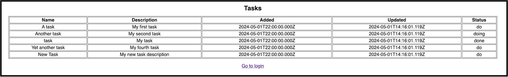

# **Accelerated Angular Part 4: Components and Presenting Data**

In [Part Three](https://www.linkedin.com/pulse/accelerated-angular-part-3-forms-user-interaction-jonathan-gold-pyjyf/), we added a form to the Login page. The form enabled a user to type their email address and password. In this installment, we will add a table to the page and display a list of tasks assigned to the user.



## **Key Concept**

In this section, we explain components, directives, and data-binding.

### **Components**

Components are the fundamental building blocks of an Angular application. Each web page in an Angular web app is a component. Each component can contain multiple sub-components. For example, a page may have a header, tables, forms, etc. In an Angular component, there is a clear separation between the presentational elements, component model, and code. Presentation elements use HTML and Angular directives, and the component model and computation use Typescript. This will become more apparent when we update tasks.component.html.

### **Directives**

Directives are classes that add additional behavior to elements in your Angular applications. There are three types:

* **Components**: Directives with templates.  
* **Structural Directives**: Alter the DOM layout by adding or removing elements (\*ngIf, \*ngFor, \*ngSwitch).  
* **Attribute Directives**: Change the appearance or behavior of an element (\[ngStyle\], \[ngClass\]).

## **Building the Tasks Page**

Let’s start by opening src/app/tasks.component.ts. In the first reference, add a reference to OnInit. This is an Angular lifecycle method that is used to initialize components, such as fetching data.

```javascript
import { Component, OnInit } from '@angular/core';
```

After the first reference, add a reference to the CommonModule. This will enable us to use Angular’s pipe functionality to format data.

```javascript
import { CommonModule } from '@angular/common';
```

Then, add a reference to the Tasks.ts data file. This file is the list of tasks assigned to the user. You can download the file from [GitHub](https://github.com/trider/ng-task-tutorial).

```javascript
import { Tasks } from '../data/tasks';
```

Next, we update @Component’s imports list to include CommonModule.

```javascript
@Component({
 selector: 'app-tasks',
 standalone: true,
 imports: [CommonModule,RouterLink],
 templateUrl: './tasks.component.html',
 styleUrl: './tasks.component.scss'
})
```

## **Extending TasksComponent**

After we have referenced the relevant components and files, we will extend the TasksComponent class so we can add a ngOnInit method. We extend the component class with the implements keyword, followed by OnInt.

```javascript
export class TasksComponent implements OnInit {}
```

## **Declaring Task and User Data**

Now let’s add the following variables. The tasks object is assigned the data from the imported Tasks list. Since we only want to display tasks created or assigned to the authenticated user, we will filter the tasks list by username and assign the data to the tableData object. The tableCols object is a list of the names of each table column. The user object holds the authenticated user profile.

```javascript
export class TasksComponent implements OnInit {
 tasks:any = Tasks;
 tableData:any = null
 tableCols: any = ['name','description','added','updated','status'];
 user:any = null;
}
```

## **Initializing the Tasks Component**

Following the variable declarations, we add a constructor method. While we are not currently using the constructor, we will need it in the future to consume Angular services. After the constructor, we add an empty ngOnInit method.

```javascript
constructor() { }
ngOnInit(): void {}
```

We will use ngOnInit to retrieve the persisted user profile from the browser’s session storage. The profile is assigned to the user object.

```javascript
ngOnInit(): void {
  this.user = JSON.parse(sessionStorage.getItem('user') || '{}');
}
```

Finally, we filter the tasks object to include only tasks assigned to the authenticated user. The filtered tasks list is assigned to the tableData object. This object will be displayed in a table in the .html page.

```javascript
this.tableData = this.tasks.filter((task:any) =>
  task.user === this.user.userName
);
```

## **Presenting Tasks Data**

Open tasks.component.ts, and replace the file’s content with the following

```html
<div class="container" >
 <h1>Tasks</h1>
 <p><a routerLink="/login">Go to login</a></p>
</div>
```

Following the \<h1\>Tasks\</h1\>, add a table.

```html
<h1>Tasks</h1>
<table></table>
```

In the table, add a table header with a single row. By embedding a \*ngFor directive in a \<th\> tag, we iterate through the tableCols object using cols as iterator. Using double braces, each value in tableCols is displayed using interpolation. To convert the col from lower to title case, we apply the titlecase pipe. This was made possible by referencing the CommonModule.

```html
<thead>
 <tr>
  <th *ngFor="let col of tableCols" scope="col">{{col|titlecase}}</th>
 </tr>
</thead>
```

After the table header, we add a table body with a single row and a single \<td\> tag. Here, we embed two \*ngFor directive. The first directive iterates through the tasks list. The second iterates through the tableCols object and only displays each field in the object.

```html
<tbody>
 <tr *ngFor="let item of tableData">
  <td *ngFor="let col of tableCols">{{item[col]}}</td>
 </tr>
 </tbody>
```

When you refresh the page in the browser, you should see a list of the user’s tasks displayed.


## **Conclusion and What’s Next**

In this installment, introduced Angular Components and Directives. We then showed you how to implement them by extending the Tasks component to display a table with all the tasks assigned to the authenticated user. In the next installment, we will look at how to improve our app's appearance with theming.
