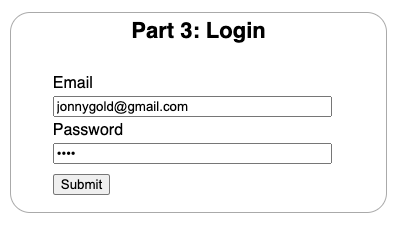
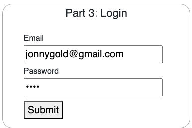
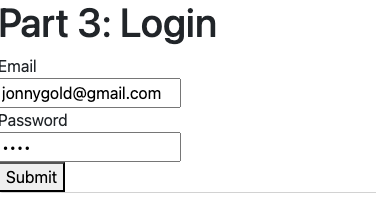
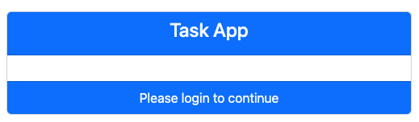
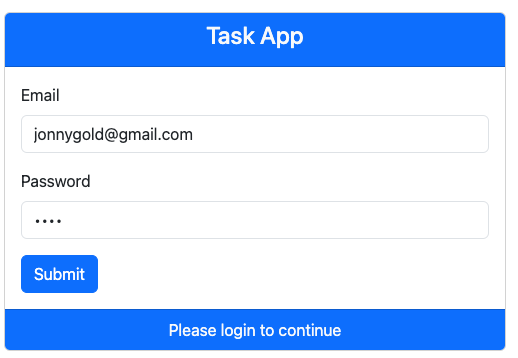
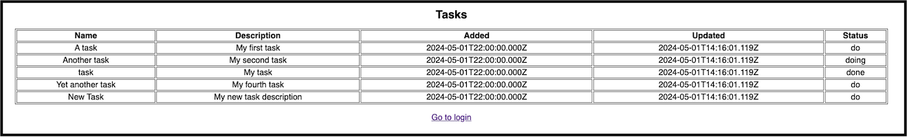
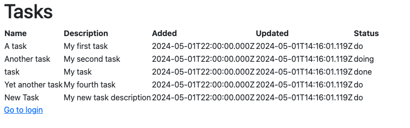
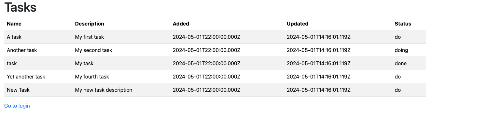

# **Accelerated Angular Part 5: Styling with Bootstrap**

In [Part Four](https://www.linkedin.com/pulse/accelerated-angular-part-4-components-presenting-data-jonathan-gold-iatdf/), we introduced Angular Components and Directives. We then showed you how to implement them by extending the Tasks component to display a table with all the tasks assigned to the authenticated user. At this point, our code is functional, but our pages could be prettier. Let’s face it: most developers, myself included, are not web designers, so we need some help from that department. The good news is that we don’t have to be, and there are a number of available solutions. In this installment, we dive into one of those solutions and investigate how we can use Bootstrap to make our app look and feel more professional. The sample code for this installment is available on [GitHub](https://github.com/trider/rapid-react-tutorial/tree/76624d7d8df10986c6152f5b2a85b503e4255751/rapid-react-tutorial-05).

## **Key Concepts**

In this section, we provide background and context on CSS and Bootstrap.

### **CSS**

[Cascading Style Sheets (CSS)](https://developer.mozilla.org/en-US/docs/Web/CSS) is a language for managing the appearance of web pages. It allows you to separate the presentation of those pages from its underlying (HTML) content. CSS defines selectors that map to individual HTML elements. For each element, you can set properties (attributes) and the values to set for the properties. In the following example, we put the color and weight of a top-level heading (H1) element.

```css
h1 {
    color:red;
    font-weight: bold;
}
```

In addition to mapping to HTML elements, you can create class selectors that apply to a group of elements. You can also target specific elements by creating ID selectors.

### **Bootstrap**

[Bootstrap](https://getbootstrap.com/) is a popular, flexible, and easy-to-use CSS framework. It was created by Twitter and made available as an open-source project. Bootstrap was designed to operate with Javascript, and specific versions are available for popular frameworks, such as React, Angular, and Vue.js. We will be using [NG Bootstrap](https://ng-bootstrap.github.io/#/home).

## **Installing Bootstrap**

You can install NG Bootstrap with the [Angular CLI ng add](https://angular.dev/cli/add) command. In your IDE’s integrated terminal, open the project folder and type:

ng add @ng-bootstrap/ng-bootstrap

If this doesn’t work, follow the detailed instructions on the NG Bootstrap website’s [Getting Started page](https://ng-bootstrap.github.io/#/getting-started). Now, all you need to do is update src/styles.scss. If you are using Angular 19, add the following to the top of the file

`@use "bootstrap/scss/bootstrap";`

If you are using an earlier Angular version, replace `@use` with `@import`:

## **Applying Bootstrap to the Login Page**

Before we installed Bootstrap, our login page looked like this:



After installing and referencing Bootstrap, it looks like this:



It looks similar to the original version, with minor changes to some elements. Now, let’s comment out the original styles in src/styles.scss. After refreshing the page, it looks like this:



The box that surrounded the form disappeared, and the form was shoved to the left edge of the page. Now, let’s replace our existing Login page with an improved Bootstrap version. Open src/app/login/login.component.html and replace the current contents of the file with the following: 

```html
<div class="container d-lg-flex">
 <div class="mx-auto p-2" style="margin-top: 100px;width:40%"></div>
</div>
```

This adds a flexible container element that can expand and contract in relation to the browser window. Inside the container, we added a div element that will position the form elements on the page. Next, let’s add a card component to hold our login form.

```html
<div class="container d-lg-flex">
 <div class="mx-auto p-2" style="margin-top: 100px;width:40%">
  <div class="card">
    <div class="card-header bg-primary">
       <h4 class="text-light text-center">Task App</h4>
     </div>
     <div class="card-body"></div>
     <div class="card-footer bg-primary text-light text-center">Please login to continue</div>
   </div>
 </div>
</div>
```

The Card’s header includes a header and footer. The header displays the Application name, and the footer provides instructions.



In the card’s body section, let’s add our form with the appropriate Bootstrap CSS classes.

```html
<div class="card-body">
 <form [formGroup]="loginForm" class="form" (ngSubmit)="onSubmit()">
  <div class="mb-3">
   <label class="form-label">Email</label>
   <input class="form-control" formControlName="email">
  </div>
  <div class="mb-3">
   <label class="form-label">Password</label>
   <input class="form-control" formControlName="password" type="password">
  </div>
  <button type="submit" class="btn btn-primary">Submit</button>
 </form>
</div>
```

When we refresh the page, it looks much improved.



## **Updating the Tasks Page**

Before we applied Bootstrap, the Tasks page looked like this:



Using our updated Login page, let’s log in and view our user’s assigned tasks. The Tasks page now looks like this:



This is a slight improvement, but it’s still not taking full advantage of Bootstrap. 

Open src/app/tasks/tasks.component.html. Modify the opening table tag by adding the following Bootstrap CSS classes.

```html
<table class="table table-striped>
```

Now the table looks like this.



## **Conclusion and What’s Next**

In this installment, showed you the basics of Cascading Style Sheets (CSS) and how to use them to change how our app looks. We then introduced Bootstrap and how we can use it to improve the appearance of our simple HTML pages. In the next installment, we will continue to use Bootstrap as we explain how to create and style reusable Angular components.
