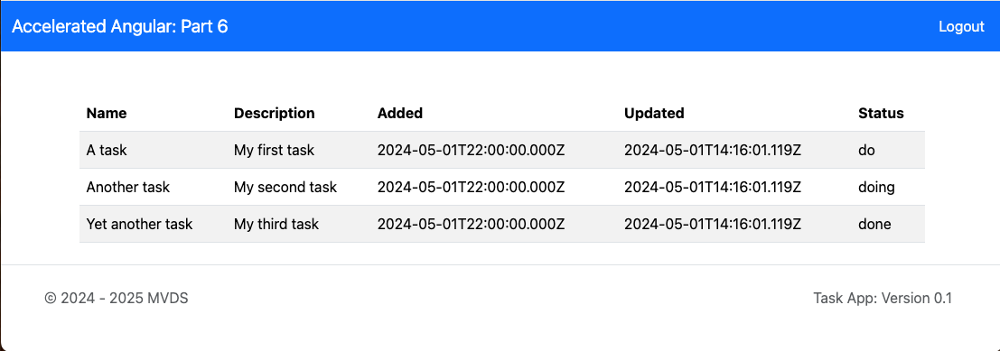

# **Accelerated Angular Part 6: Creating Reusable Components**

In [Part Five](https://www.linkedin.com/pulse/accelerated-angular-part-4-components-presenting-data-jonathan-gold-iatdf/), we showed you the basics of Cascading Style Sheets (CSS) and how to use them to change how our app looks. We then introduced Bootstrap and how we can use it to improve the appearance of our simple HTML pages. In this installment, we will build on this foundation to add a page header that displays the name App and will let us return to the Login page. At the bottom of the page, we will provide a footer that displays copyright and version information.



The sample code for this installment is available on [GitHub](https://github.com/trider/accelerated-angular-tutorial/tree/211acbfd99de9a67fcae438646f4d3ac19f23cdf/ng-task-tutorial-06).

## **Key Concept**

In this section, we explain component metadata. You use this metadata to reference components.

### **Component Metadata**

Angular components provide information called metadata. This metadata is provided by the @Component decorator. This is located at the top of the component’s typescript file.  Here is the @Component decorator for the Tasks component (tasks.component.ts).

```javascript
@Component({  
 selector: 'app-tasks',  
 standalone: true,  
 imports: [ CommonModule,RouterLink ],  
 templateUrl: './tasks.component.html',  
 styleUrl: './tasks.component.scss'  
})
```

The component metadata includes the following elements:

* **Selector:** The name of the component. The selector can be used as a reference to the component  
* **Standalone:** Indicates that the component can be imported into other components.  
* **Imports:** The packages, libraries, and components referenced by the component.
* **URLs:** Location of related files, such as the component template HTML file and CSS style sheet.

### **Referencing Subcomponents**

Subcomponents provide a way to share standard functionality using generic components. For example, we could extract the table from our Tasks component and create a Table subcomponent. This means that when we create a new page that includes a table, we don’t need to make the table from scratch. In fact, we can include multiple table instances in a single page. We reference the tab by creating HTML tags with the component’s selectors.

```html
<app-table ></app-table>
```

## **Creating a Navigation Bar**

Let’s start by creating a Navigation bar. This provides a page header that displays the name of the app. It also provides a Logout button. Clicking the button returns the user to the Login page.


In your IDE’s integrated terminal, open the project folder and type:

ng generate component components/navbar

The following files are created.


Open src/app/components/navbar/navbar.component.ts. Replace the current code with the following:

```javascript
import { Component } from '@angular/core';  
import { CommonModule } from '@angular/common';

@Component({  
 selector: 'app-navbar',  
 standalone: true,  
 imports: [ CommonModule ],  
 templateUrl: './navbar.component.html',  
 styleUrl: './navbar.component.scss'  
})  
export class NavbarComponent {  
 constructor() { }  
}
```

## **Adding a Footer**

At the bottom of the page,  we will create a footer that displays copyright and version information. ![][image4]

In your IDE’s integrated terminal, open the project folder and type:

ng generate component components/footer

The command generates the following files:


Open src/app/components/footer/footer.component.ts. Replace the current code with the following:

```javascript
import { Component } from '@angular/core';  
import { GlobalVariables } from '../../data/global-variables';  
import { DatePipe } from '@angular/common';

@Component({  
 selector: 'app-footer',  
 standalone: true,  
 imports: [ DatePipe ],  
 templateUrl: './footer.component.html',  
 styleUrl: './footer.component.scss'  
})

export class FooterComponent {  
 currentYear!: number;  
 appVersion:string = GlobalVariables.appVersion;  
 constructor() {  
   this.currentYear = Date.now();  
 }  
}
```

In order to display current copyright information, the component includes a variable called currentYear. This information will displayed in the template page using the Angular DatePipe directive. It also references an external file that includes the current application version.

Next, we will update the Footer page’s HTML template. Open src/app/components/footer/footer.component.ts. Replace the current code with the following:

```html
<div class="container">  
 <footer class="d-flex flex-wrap justify-content-between align-items-center py-3 my-4 border-top fixed-bottom p-5">  
  <p class="col-md-4 mb-0 text-muted">  
   &copy;  2024 - {{currentYear | date : 'yyyy'}} MVDS</p>  
  <a href="/"   
   class="col-md-4 d-flex align-items-center justify-content-center   
          mb-3 mb-md-0 me-md-auto link-dark text-decoration-none"  
    >  
    <svg class="bi me-2" width="40" height="32">  
    <use xlink:href="#bootstrap"/></svg>  
  </a>  
  <ul class="nav col-md-4 justify-content-end">  
    <li class="nav-item">  
      <a href="#" class="nav-link px-2 text-muted">  
       Task App: Version {{appVersion}}   </a>  
    </li>  
  </ul>  
 </footer>  
</div>
```

## **Referencing Page Component**

In order to include our new page components, we need to reference them from the Tasks page.

Open src/app/tasks/tasks.component.ts.

At the top of the page, import the Navbar and Footer components.

```javascript
import { NavbarComponent } from '../components/navbar/navbar.component';  
import { FooterComponent } from '../components/footer/footer.component';
```

In the @Component directive’s imports list, add NavbarComponent and FooterComponent.

```javascript
@Component({  
 selector: 'app-tasks',  
 standalone: true,  
 imports: [ CommonModule, NavbarComponent, FooterComponent ],  
 templateUrl: './tasks.component.html',  
 styleUrl: './tasks.component.scss'  
})
```

All we need to do now is update the template (HTML) page.

Open src/app/tasks/tasks.component.html.

At the top of the page, add a reference to the Navbar component.

```html
<app-navbar></app-navbar>
```

At the bottom of the page, add a reference to the Footer component.

```html
<app-footer></app-footer>
```

Refresh the page and the new components are displayed.


## **Conclusion and What’s Next**

In this installment, we introduced the concepts of Angular metadata. We illustrated how metadata is used to reference components. Then we created to two new reusable page components and added them to our tasks page. In the next installment, we will create two more components and show you how to pass data from a component. We will also show you how to return data from a component.
