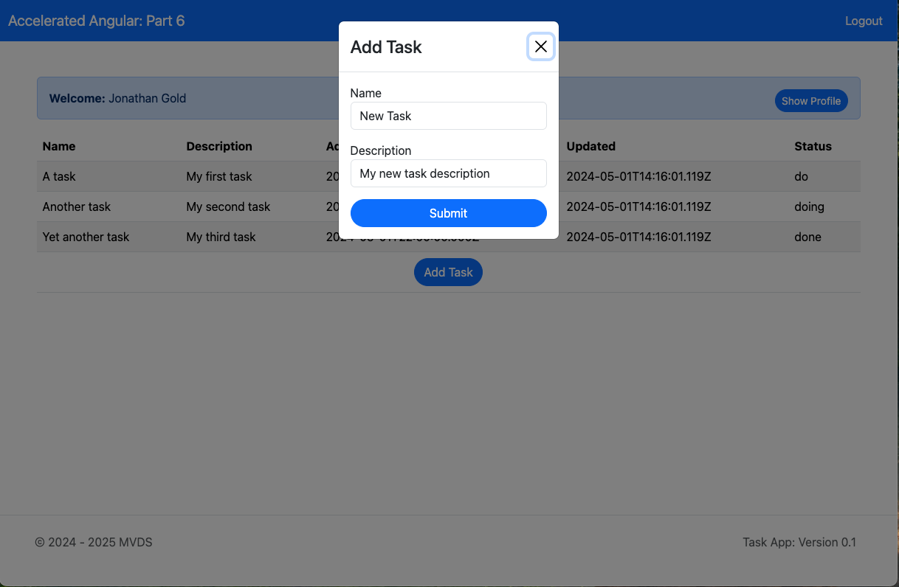
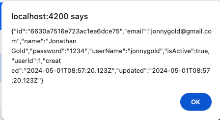
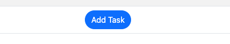
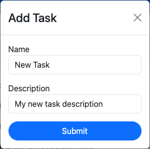
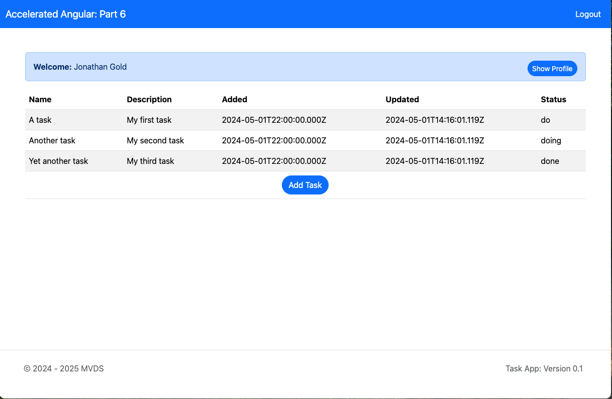

# **Accelerated Angular Part 7: Passing Data Between Components**

In [Part Six](https://www.linkedin.com/pulse/accelerated-angular-part-4-components-presenting-data-jonathan-gold-iatdf/), we created two new reusable page components and added them to our tasks page. In this installment, we will make two more components and show you how to pass data from a component. We will also show you how to return data from a component.



The sample code for this installment is available on [GitHub](https://github.com/trider/accelerated-angular-tutorial/tree/b94920506af437d02a66211673ea7d1c8bc27d98/ng-task-tutorial-07).

## **Key Concept**

In this section, we explain the @Input and how you can use it to pass data to a child component. We also introduce the @Output directive and how you can use it to pass data back to the parent component.

### **@Input Directive**

In [Part Six](https://www.linkedin.com/pulse/accelerated-angular-part-4-components-presenting-data-jonathan-gold-iatdf/), we illustrated how we could create components to share standard functionality. We explained how we could extract the table from our Tasks component and create a Table subcomponent. This means that when we create a new page that includes a table, we don’t need to make the table from scratch. Then, we created two components that used hard-coded data. This works for our NavigationBar and Footer components. However, it won’t work for our Table component.

In this installment, we will fix this by creating components that use the @Input directive. First, you create a variable in your child component. The variable is declared by adding an @Input decorator before the variable name.

```javascript
@Input() user:any = null;
```

In the parent component, you add the variable name and the data you want to add to the referenced component. In this case, we pass a list of tasks to the table. If we now create a Users page, we can reuse the same component and pass a list of users.

```html
<app-table [data]= "tasks"></app-table>
```

### **@Output Directive**

Not only can you pass data to a child component, but you can also pass data back to its parent. For example, the table component lets the user modify the list of tasks. However, the component lacks the functionality to save the modified data to a backend database. We pass the data back to the parent component using an @Output directive. Like the @Input directive, the first step is to declare a variable prefixed with an @Output decorator. The variable creates a new EventEmitter.

```javascript
@Output() addTaskEvent = new EventEmitter<any>();
```

 When the event is called, an event is triggered. This event emits an object.

this.addTaskEvent.emit(data)

The parent component listens for the event, which will be processed by a method (function) in the parent component. The $event parameter captures the event and passes the object for processing by the function.

```html
<app-table (addTaskEvent)="addTask($event)"</app-table>
```

## **Passing Data to a Component**

To understand how to pass data with an @Input directive, we will create a Profile component. The component displays a banner with a welcome message. It also includes a button that displays the profile of the current user. We will use [NG Bootstrap’s Alert](https://ng-bootstrap.github.io/#/components/alert/examples) component to create the banner.



In your IDE’s integrated terminal, open the project folder and type:

ng generate component components/profile

Open src/app/components/profile/profile.component.ts. Add a reference to NG Bootstrap’s NgbAlertModule.

import { NgbAlertModule } from '@ng-bootstrap/ng-bootstrap';

Update the @components directive’s import section to include the NgbAlertModule.

```javascript
@Component({  
 selector: 'app-profile',  
 standalone: true,  
 imports: [ CommonModule, NgbAlertModule ],  
})
```

Now, let’s use the  Input directive to pass user data to the component. At the top of the page, add a reference to the Angular’s Input directive.

```javascript
import { Component, Input } from '@angular/core';
```

In the ProfileComponent class, add an Input variable that receives user data. In the class, add the showProfile method. This method will be called when the user presses a button. The method displays an Alert with the user profile.

```javascript
export class ProfileComponent {  
 @Input() user:any = null;  
}
```

In the class, add the showProfile method. This method will be called when the user presses a button.

```javascript
export class ProfileComponent {  
 @Input() user:any = null;  
   
 showProfile(){   
  alert(JSON.stringify(this.user))  
 }  
}
```

The method displays an Alert with the user profile.



Open src/app/components/profile/profile.component.html. Replace the current code with the following:

```html
<ngb-alert [dismissible]="false" [type]="'primary'">  
 <strong>Welcome:</strong> {{user.name}}  
  <button   
    class="btn btn-primary btn-sm rounded-pill float-end"     
   (click)="showProfile()">Show Profile  
  </button>  
</ngb-alert>
```

## **Return Data to a Parent Component**

To demonstrate how to pass data back to a parent component. We will create a component that provides a button to add a new task.


Clicking the button opens a modal with a basic form.



When you click the submit, the new task will emit an addTaskEvent. When the Tasks component catches the event, it adds the new task to the tasks list.

In your IDE’s integrated terminal, open the project folder and type:

```bash
ng generate component components/modal
```

Open src/app/components/modal/modal.component.ts. At the top of the file, add the following references.

```javascript
import { Component, Output, EventEmitter } from '@angular/core';  
import { FormGroup, FormControl, ReactiveFormsModule } from '@angular/forms';  
import { CommonModule } from '@angular/common';  
import { NgbModal } from '@ng-bootstrap/ng-bootstrap';
```

Update the @components directive’s import section to include the ReactiveFormsModule.

```javascript
@Component({  
 selector: 'app-modal,  
 standalone: true,  
 imports: [ CommonModule, ReactiveFormsModule],  
})
```

At the top of the file, declare the following variables.

```javascript
 @Output() addTaskEvent = new EventEmitter<any>();  
 title:string = "Add Task";  
 user:any = JSON.parse(sessionStorage.getItem('user') || '{}');
```

After these variables, we create a form group to capture task data.

```javascript
taskForm = new FormGroup({  
   user: new FormControl(this.user.userName),  
   name: new FormControl('New Task'),  
   description: new FormControl('My new task description'),  
   status: new FormControl('do'),  
});
```

In the ModalCompent’s class’s constructor, declare a modalService attribute that references NG Bootstrap’s [Modal](https://ng-bootstrap.github.io/#/components/modal/examples) service. This will enable us to build the Add Task modal.

```javascript
 constructor(  
   private modalService: NgbModal,  
 ) { }
```

Let’s now add an openModal method that opens the modal.

```javascript
openModal(content:any, title:string, item:any = null) {  
   this.title = title;  
   this.modalService.open(content, { size: 'sm', scrollable: true })  
}
```

Finally, we will add an onSubmit method. This captures the form data, triggers the addTaskEvent, and closes the modal.

```javascript
onSubmit(){  
   this.addTaskEvent.emit(this.taskForm.value)  
   this.modalService.dismissAll()  
 }
```

Now, let’s update the HTML template. First, we will add a modal template. This includes \#content tag that will be used to display the modal popup.

```html
<ng-template #content let-modal>  
<div class="modal-header">  
  <h4 class="modal-title text-center" id="modal-basic-title">{{title}}</h4>  
  <button type="button" class="btn-close" aria-label="Close" (click)="modal.dismiss('Cross click')"></button>  
</div>  
<div class="modal-body">  
</div>  
</ng-template>
```

In the modal body, add the taskForm.

```html
<form class="form"[formGroup]="taskForm"(ngSubmit)="onSubmit()">  
 <div class="mb-3">  
  <label>Name</label>  
  <input  
   type="text"  
   class="form-control"   
   id="taskName"   
   placeholder="Enter Task Name"   
   formControlName="name">  
  </div>  
  <div class="mb-3">  
   <label>Description</label>  
    <input   
     type="text"   
     class="form-control"   
     id="taskDescription"   
     placeholder="Enter Task Description"  
     formControlName="description">  
  </div>  
  <div class="text-center d-grid">  
    <button type="submit" class="btn btn-primary rounded-pill ">Submit</button>  
  </div>  
</form>
```

At the bottom of the page, add a button to open the modal.

```htm
<div class="d-grid gap-2 d-md-flex justify-content-md-center">  
 <button   
  class="btn btn-primary rounded-pill"   
  (click)="openModal(content, 'Add Task')"  
  >  
  Add Task  
 </button>  
</div>
```

## **Referencing Page Components**

In order to include our new page components, we need to reference them from the Tasks page.

Open src/app/tasks/tasks.component.ts.

At the top of the page, import the Navbar and Footer components.

```javascript
import { ProfileComponent } from '../components/profile/profile.component';  
import { ModalComponent } from '../components/modal/modal.component';
```

In the @Component directive’s imports list, add ProfileComponent and ModalComponent.

```javascript
@Component({  
 selector: 'app-tasks',  
 standalone: true,  
 imports: [ CommonModule, NavbarComponent, FooterComponent, ProfileComponent,  
   ModalComponent  
 ],  
 templateUrl: './tasks.component.html',  
 styleUrl: './tasks.component.scss'  
})
```

Now, we add an addTasks function that adds the task to the tasks list.

```javascript
addTask(task:any){  
   this.tableData = [  
     ...this.tableData,  
     {  
       ...task,  
       added: new Date().toISOString(),  
       updated: new Date().toISOString(),  
       taskId: this.tableData.length + 1,  
       isActive: true,  
     }  
   ]  
 }

```

All we need to do now is update the template (HTML) page.

Open src/app/tasks/tasks.component.html. Insert the Profile component before the table. Add a table footer section to the table, to hold the Modal component.

```htm
<app-navbar></app-navbar>  
<div class="container mt-5" >  
 <app-profile [user]="user"></app-profile>  
 <table class="table table-striped w-100">  
   ...  
   <tfoot>  
     <tr>  
       <td colspan="6">  
         <app-modal (addTaskEvent)="addTask($event)"></app-modal>  
       </td>  
   </tfoot>  
 </table>  
</div>  
<app-footer></app-footer>
```

Refresh the page, to display the new components.



## **Conclusion and What’s Next**

In this installment, we introduced you to the @Input and @Output directives. Then, we described how to use them to pass data to and from components. We also showed you how to use the Bootstrap Alert and Module modules to display data. In the next and final installment in this series, we will show you how to send and receive data from an API using Angular services.
