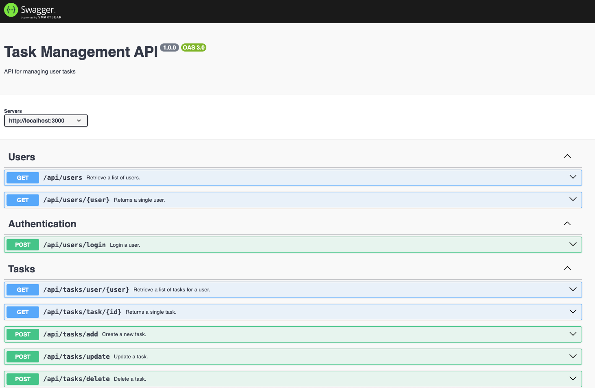

# **Accelerated Angular Part 8: Integrating APIs**

In [Part Seven](https://www.linkedin.com/pulse/accelerated-angular-part-6-creating-reusable-components-jonathan-gold-bh57f/), we introduced you to the @Input and @Output directives. Then, we described how to use them to pass data to and from components. We also showed you how to use the Bootstrap Alert and Module modules to display data.


Currently, our Angular app performs a very simple authentication and displays a list of tasks. The data for these actions is stored in two Javascript files. This is great for demonstration purposes but has a number of limitations, such as we are working with limited data sets, and we can’t permanently add, modify, or delete data. In this installment, we will start to change this by integrating our code with a Rest API. Specifically, we will update the Login and Tasks components to interact with a Task Management API. The sample code for this installment is available on [GitHub](https://github.com/trider/accelerated-angular-tutorial/tree/b94920506af437d02a66211673ea7d1c8bc27d98/ng-task-tutorial-08).

## **Key Concept**

In this section, we explain Angular Services, handling asynchronous events, and Cross-Origin Resource Requests.

### **Services**

An Angular service is a reusable component that enables you to share code or data across your application. Each service is a component class that provides public methods (functions) that you can access within other components. Services implement the singleton design pattern. This means that there is only one instance of each service at any time. All components can access this instance. A common use of services is to provide shared access to Angular’s HTTP client. Angular’s HTTP client allows access to servers and APIs.

### **Reactive Javascript Extensions (RxJS)**

Javescript-based frameworks, such as Angular, support asynchronous operations. A typical example of an asynchronous operation is sending a request to a remote server. After you send the request, the application has to wait until it receives the response. If the request were handled synchronously, then your application would have to wait for the response before proceeding. Handling requests asynchronously means that your application can continue to function during this waiting period.

Angular uses the [Reactive Javascript Extensions (RxJS)](https://rxjs.dev/) library to manage asynchronous operations with observables. An observable is a stream of data received at a later time. You can create an observable from nearly anything, but the most common use case in RxJS is from events. For example, to return read-only data from a server, we create a service. The service includes an observable method called getServiceData that sends HTTP requests.

```javascript
public getServiceData(url: any): Observable<any> {  
   return this.http.get<any>(url);  
}  
```

The getServiceData method is available to any component that consumes its parent service. The component can access the getServiceData observable via an RxJS subscription. For example, to receive a list of tasks, we subscribe to getServiceData by sending the path of the relevant API endpoint. After sending the path, it waits to receive response data. The subscription is updated when the response to the request is received.

```javascript
this.httpService.getServiceData(this.path).subscribe((data: any) => {  
     this.tableData = data  
});
```

### **Cross-Origin Resource Requests**

Cross-Origin Resource Requests (CORS) is a web standard that protects request-related security issues. CORS prevents web pages from making requests from a domain (address) other than the one from which the page was served. CORS can cause problems when developing a web application and could prevent you from accessing and displaying data. We will address one solution later in this article.

## **Task Management API**

The API we will work with was created for my tutorial series [Node JS Express for FrontEnd](https://www.linkedin.com/pulse/node-js-express-frontend-developer-complete-series-jonathan-gold-xvljf/?trackingId=NkGk3wxRRMOVCTQDlgpTFQ%3D%3D) developers. The API lets read, modify, and delete task data stored in a MongoDB database. The complete API code is described in [Part Eight: Documenting the API with Swagger](https://www.linkedin.com/pulse/node-js-express-frontend-developers-part-eight-documenting-gold-gkw4e/?lipi=urn%3Ali%3Apage%3Ad_flagship3_pulse_read%3BOzO%2Bep4dT%2ByYMnVu%2Fwllhw%3D%3D). This installment also provides a Swagger page that documents the API. You can read the series and download the sample code from the series [GitHub](https://github.com/trider/node-task-api-tutorial) repo.



## **Configuring the HTTP Client**

Angular’s HTTP client allows access to servers and APIs. Before we can use the HTTP client, we must configure our application. We start by updating our app.config.ts file to reference the HTTP client provider. Open src/app/app.config.ts and add the following reference to provideHttpClient:

```javascript
import { provideHttpClient } from '@angular/common/http';
```

Add provideHttpClient to the list of providers.

```javascript
export const appConfig: ApplicationConfig = {  
  providers: [  
   provideZoneChangeDetection({ eventCoalescing: true }),  
   provideRouter(routes)],  
   provideHttpClient(),
};
```

## **Handling CORS**

In theory, we could now proceed and update our Tasks component to receive data from the Task Management API directly. Unfortunately, Angular’s CORS protection will prevent us from accessing the API and return an error. So, before we can interact with the API, we must create an Angular proxy. An Angular proxy is a configuration file that allows you to define a set of rules to forward requests from your Angular application to a local and/or remote server. In the src/app folder, create a file called proxy.conf.json.


Open the file and add the following:

```json
{  
 "/api": {  
   "target": "http://127.0.0.1:3000",  
   "secure": false  
 }  
}
```

From now on, whenever we want to access a Task Management API endpoint, we will substitute the base API URL is replaced by ‘/api’.

Next, we must update our application’s angular.json file to instruct our app to access the API via the Angular proxy. Open angular.json, locate the serve section, and make the following changes.

```json
"serve": {  
 "builder": "@angular-devkit/build-angular:dev-server",  
 "options": {
   "proxyConfig": "src/proxy.conf.json"
  },  
 …  
}
```

## **Creating a Service**

Now, let’s create our service. In your IDE’s integrated terminal, type:

ng generate service services/http-service/http-service

This creates the following files:


Open src/app/services/http-service/http-service.service.ts. At the top of the file, add the following references.

```javascript
import { Injectable } from '@angular/core';  
import { HttpClient, HttpHeaders } from '@angular/common/http';  
import { Observable } from 'rxjs';
```

In the HttpService class, create an httpOptions object. This provides the metadata required to send requests to the Task Management API.

```javascript
httpOptions = {  
   headers: new HttpHeaders({  
     'Content-Type': 'application/json',  
     'Access-Control-Allow-Origin': '*'  
   }),  
 };
```

In the class constructor, create a variable that references the HTTP client.

```javascript
private http: HttpClient,
```

Now, add two public methods to send HTTP GET and POST requests as observables.

```javascript
public getServiceData(url: any): Observable<any> {  
   return this.http.get<any>(url);  
}

public postServiceData(url: string, payload:any): Observable<any> {  
   return this.http.post<any>(url, payload, this.httpOptions);  
}
```

## **Referencing the HTTPService**

Angular services are available to all our application’s components. Let’s start by updating the Login page. Open, src/app/login/login.component.ts. At the top of the file, add a reference to the HTTPService.

```javascript
import { HttpService } from '../services/http-service/http-service.service';
```

In the @Component directive, add a list of providers that includes the HttpService.

```javascript
@Component({  
 selector: 'app-login',  
 standalone: true,  
 imports: [  
   ReactiveFormsModule,  
 ],  
 providers: [  
   HttpService  
 ],  
 templateUrl: './login.component.html',  
 styleUrl: './login.component.scss'  
})
```

In the class constructor, create a variable that references the HTTPService.

```javascript
 constructor(  
   private router: Router,  
   public httpService: HttpService  
 ) { }
```

Now open, src/app/tasks/tasks.component.ts and repeat these steps.

## **Authenticating Users**

Now we have all the pieces in place, let’s start by using the API to authenticate users. In the onSubmit method, remove the current content.

```javascript
onSubmit(){}
```

Add a subscription using httpServices’s postServiceData method. The method accepts two parameters. The first is the path of the API endpoint. The path must conform to the format specified in our proxy.conf.json file. The second parameter is a JSON object with the user’s credentials. We extract this object from the login form.

```javascript
onSubmit(){  
 this.httpService.postServiceData('/api/users/login', this.loginForm.value).subscribe();  
}
```

In the subscribe method, we add code that receives the data. After checking that the data received from the observer is valid, the user’s profile is stored as a session variable. Finally, we call the router’s navigate method and provide the required path.

```javascript
this.httpService.postServiceData('/api/users/login', this.loginForm.value).subscribe((data: any) => {  
     if(data !==null){  
       this.user = data  
       sessionStorage.setItem('user', JSON.stringify(this.user));  
       this.router.navigate(['/tasks']);  
     }  
 });  
}
```

## **Retrieving and Displaying Tasks**

Let’s now update the Tasks page’s task list to display the tasks assigned to the current user retrieved via the API. Open, src/app/tasks/tasks.component.ts. In ngOnInit, add a subscription using the httpServices' getServiceData method. The task calls an API endpoint that retrieves a user’s assigned tasks.

```javascript
ngOnInit(): void {  
 this.user = JSON.parse(sessionStorage.getItem('user') || '{}');  
 this.httpService.getServiceData(/api/tasks/user/${this.user.userName})  
  .subscribe((data: any) => {  
     this.tableData = data  
   });  
}
```

## **Conclusion and What’s Next**

In this installment, we introduced you to Angular Services, RXJS, and CORS. We used this information to integrate our app with the Task Management API. Now, we can authenticate users and retrieve tasks directly from the API. In the next and final installment, we will complete the API integration by adding task management functionality.
