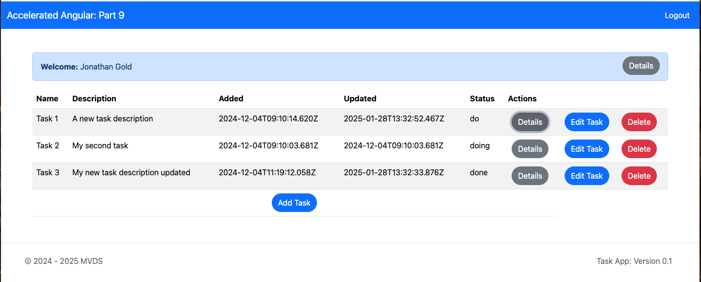
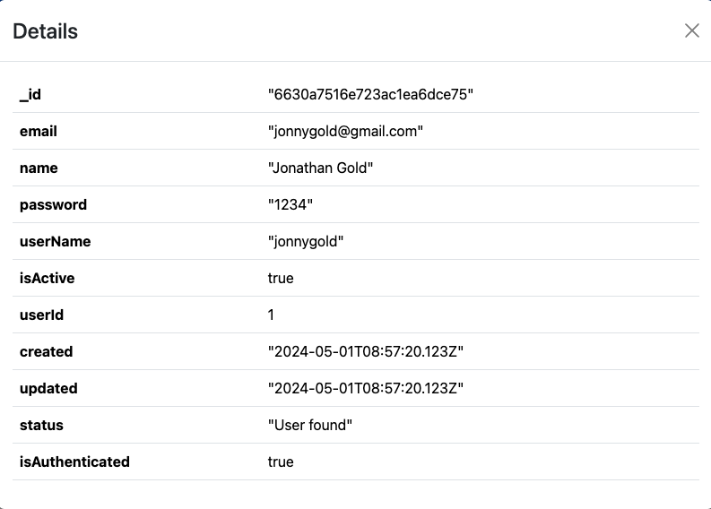
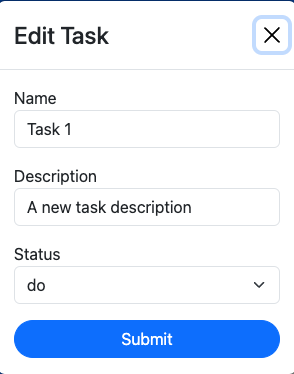
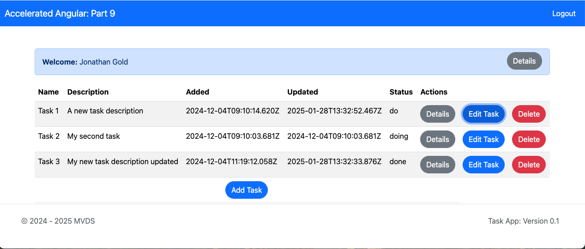

# **Accelerated Angular Part 9:  Managing Tasks**

In [Part Eight](https://www.linkedin.com/pulse/accelerated-angular-part-8-integrating-apis-jonathan-gold-iapaf/), we introduced you to Angular Services, RXJS, and CORS. We used this information to integrate our app with the Task Management API. Now, we can authenticate users and retrieve tasks directly from the API. In this installment, we will complete the API integration by adding task management functionality.



The sample code for this installment is available on [GitHub](https://github.com/trider/accelerated-angular-tutorial/tree/cd834bc78e52e3cae20b4011d2e92b84162a2e7d/ng-task-tutorial-09).

## **Display Profile and Task Data**

Let’s start by creating a new component for displaying JSON data, such as a user profile or a task. Our Modal component will display this sub-component.



In your IDE’s integrated terminal, open the project folder and type:

```console
ng generate component components/details-table
```

Open src/app/components/details-table/details-table.component.ts. At the top of the file, add the following references.

```javascript
import { Component, OnInit, Input } from '@angular/core';  
import { CommonModule } from '@angular/common';
```

Update the @components directive’s import section to include the CommonModule.

```javascript
@Component({  
 selector: 'app-details-table',  
 standalone: true,  
 imports: [ CommonModule],  
})
```

At the top of the file, declare an Input variable to receive data from a component.

```css
@Input() row:any=null
```

Add a method called getRowValues. This function will be called from details-table.component.html. The function receives an object called row. In the function, declare an array called data to hold and return the processed data. Then, declare a variable called objectArray that is the result of an Object.entries() method. This converts the rows into an iteratable object.  

```javascript
getRowValues(row:any){  
   let data:any = []  
   const objectArray = Object.entries(row);  
   objectArray.forEach(([key, value]) => {  
    data.push({key:key, value:JSON.stringify(value)})  
   });  
   return data  
}
```

Using a forEach method, we can loop through objectArray as an array (list) of key-value pairs. The key is the name of the object, and value is the value of the object, for example:

```json
{ "email": "jonnygold@gmail.com" }  
```

This value is converted to a string and appended to an array.

Open src/app/components/details-table/details-table.component.ts. Remove the boilerplate code with this table.

```htm
<table class="table">  
 <tbody >  
  <tr *ngFor="let val of getRowValues(row);let i = index">  
   <th style="vertical-align: top;">  
     <span>{{val.key}}</span>  
   </th>  
   <td>{{val.value}}</td>    
  </tr>  
 </tbody>  
</table>
```

The table calls getRowValues and passes the row object input object. It displays the key in the left column and its corresponding value in the right column.

## **Managing Tasks**

Our next task is to modify the Modal component to manage tasks. In addition to the Task Add and Details table, the Modal will support task editing. This includes the ability to change a tasks status.



First, we add references to DetailsTableComponent.

```javascript
import { DetailsTableComponent } from '../details-table/details-table.component';

@Component({  
 selector: 'app-modal',  
 standalone: true,  
 imports: [ CommonModule, ReactiveFormsModule,DetailsTableComponent],  
 templateUrl: './modal.component.html',  
 styleUrl: './modal.component.scss'  
})

```

Update the ModalComponent class’s input and output variables.

```javascript
export class ModalComponent {  
 @Input() tableData: any;  
 @Input() title:string = "Add Task";  
 @Input() item:any = null;  
 @Input() size: string = 'sm';  
 @Output() taskEvent = new EventEmitter<any>();
```

Add a user variable to retrieve the stored user profile. Then, add the taskStatus list.

 ```javascript
 user:any = JSON.parse(sessionStorage.getItem('user') || '{}');  
 taskStatus:string[] = ["do","doing","done"];  
 Update the taskForm object to include task status.

taskForm = new FormGroup({  
   user: new FormControl(this.user.userName),  
   name: new FormControl('New Task'),  
   description: new FormControl('My new task description'),  
   status: new FormControl('do'),  
 });
 ```

Modify the openModal class method to support task editing. The function checks if the taskForm’s title is set to ‘Edit Task’ and populates the taskForm accordingly.

```javascript
openModal(content:any, title:string) {  
   if(this.title === "Edit Task"){  
     this.taskForm.patchValue({  
       name: this.item.name,  
       description: this.item.description,  
       status: this.item.status,  
     });  
   }  
    this.modalService.open(content, { size: this.size, scrollable: true })  
 }
```

Now, update onSubmit to support adding and editing tasks. Depending on the option, the sendTask method is called and passed an object that includes the path of the API endpoint and a payload (data) to be sent.

```javascript
 onSubmit(){  
   if (this.title==='Add Task'){  
     this.sendTask({  
       path:'/api/tasks/add',  
       data:{  
         ...this.taskForm.value,  
         added: new Date().toISOString(),  
         updated: new Date().toISOString(),  
         taskId: this.tableData.length + 1,  
         isActive: true,  
          
       }  
     })  
   }  
   else if (this.title==='Edit Task'){  
     this.sendTask({  
       path:/api/tasks/update/${this.item.taskId},  
       data:{  
         ...this.taskForm.value,  
         updated: new Date().toISOString(),  
         isActive: true,  
       }  
     })  
   }  
 }
```

Add the sendTask function to pass the task data back to the Tasks component. The data is passed using the taskEvent object’s emit method.

```javascript
sendTask(payload:any){  
   this.taskEvent.emit(payload)  
   this.modalService.dismissAll()  
}
```

After updating the code file, we update the component’s html. Open src/app/components/details-table/details-table.component.ts. In the modal-body add two HTML divs that check if title is set to ‘Details’

```html
<div class="modal-body">  
  <div *ngIf="title==='Details'"></div>  
  <div *ngIf="title!=='Details'"></div>  
</div>
```

In the top div, add a reference to the details-table component. Assign the row input variable the item passed to the Modal.

```htm
<div *ngIf="title==='Details'">  
 <app-details-table [row]="item"></app-details-table>  
</div>
```

In the second div, insert the task form. At the bottom of the form, add a select component that displays a list of task statuses. This list is only displayed when editing a task.

```htm
<div *ngIf="title!=='Details'">  
 <form class="form" [formGroup]="taskForm" (ngSubmit)="onSubmit()">  
   …  
   <div class="mb-3" *ngIf="title === 'Edit Task'">  
    <label>Status</label>  
     <select class="form-select" formControlName="status">  
      <option *ngFor="let item of taskStatus" [value]="item">{{item}}</option>  
      </select>  
     </div>  
   …  
 </form>  
</div>
```

After the Modal, template, update the button section with the following code:

```htm
<div class="d-grid gap-2 d-md-flex justify-content-md-center">  
 <button *ngIf="title!=='Details'"class="btn btn-primary rounded-pill"  
  (click)="openModal(content, title)"  
 >  
 {{title}}  
 </button>  
 <button *ngIf="title==='Details'" class="btn btn-secondary rounded-pill"  
  (click)="openModal(content, title)"  
 >  
 {{title}}  
 </button>  
</div>
```

## **Updating the Tasks Component**

After modifying the subcomponents, we can update the Task component’s table to support the new task management functionality.

Open src/app/tasks/tasks.component.ts.

Move this line of code from ngOnInit to the constructor.

```javascript
constructor(  
   public httpService:HttpService  
 ) {  
   this.user = JSON.parse(sessionStorage.getItem('user') || '{}');  
}
```

Create a new function called getTasks and move the code that requests tasks to it from ngOnInit.

```javascript
getTasks(){  
 this.httpService.getServiceData(/api/tasks/user/${this.user.userName})  
  .subscribe((data: any) => {  
     this.tableData = data  
 });  
}
```

Now, we update the list of tasks when the page loads, and when we add, edit, or delete tasks.

In ngOnInit, add a call to getTasks.

```javascript
ngOnInit(): void {  
  this.getTasks()  
}
```

Next, add a function that deletes tasks. This sends a path and a payload to a function that handles HTTP post requests to the API.

```javascript
 deleteTask(item:any){  
   this.manageTask({  
     path:/api/tasks/delete,  
     data:{  
       taskId:item.taskId  
     }  
   })  
 }
```

Now, add the manageTask function to send the payload using the the httpServices’s postServiceData method.

```javascript
manageTask(task:any){  
 this.httpService.postServiceData(task.path, task.data).subscribe((data: any) => {  
     if(data !==null)this.getTasks()  
 });  
}
```

Open src/app/tasks/tasks.component.ts. In the table header, add the following row:

```htm
<th colspan="3">Actions</th>
```

The row has a colspan (width) of three columns. This matches the three buttons we will add to each row of the table body with this code.

```html
<tbody>  
 <tr *ngFor="let item of tableData">  
  <td *ngFor="let col of tableCols">{{item[col]}}</td>  
  <td>  
   <app-modal [title]="'Details'" [item]="item" [size]="'lg'"></app-modal>  
  </td>  
  <td>  
   <app-modal   
    [title]="'Edit Task'"   
    [item]="item"  
    (taskEvent)="manageTask($event)"  
   >  
   </app-modal>  
  </td>  
  <td>  
   <button   
    class="btn btn-danger rounded-pill"   
   (click)="deleteTask(item)"   
   >  
   Delete  
   </button>  
  </td>  
 </tr>  
</tbody>
```

## **Modifying the Profile Component**

Our final change is to update the Profile component to use display a Modal with the Details table. Open src/app/components/profile/profile.component.ts. Add a reference to ModalComponent an update the @Component directive.

import { ModalComponent } from '../modal/modal.component';  
@Component({  
 selector: 'app-profile',  
 standalone: true,  
 imports: [ CommonModule, NgbAlertModule, ModalComponent ],  
 templateUrl: './profile.component.html',  
 styleUrl: './profile.component.scss'  
})

Open src/app/components/profile/profile.component.html. Replace the existing code with:

```htm

<ngb-alert [dismissible]="false" [type]="'primary'">  
 <strong>Welcome:</strong> {{user.name}}  
 <span class="float-end" style="margin-top: -9px;">  
   <app-modal [title]="'Details'" [item]="user" [size]="'lg'"></app-modal>  
 </span>  
</ngb-alert>
```

Refresh your browser and the following is displayed.



## **Conclusion and What’s Next**

In this installment, we completed our application by adding task management features. If you enjoyed this series, check out my previous series on NodeJS or React. Both are available from my website at [https://jonnygold.net](https://jonnygold.net).
